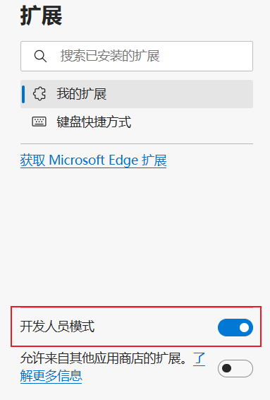

# Edge浏览器扩展

浏览器扩展是浏览器的一个特性，它允许我们为浏览器添加一些功能，比如修改网页内容、添加新功能、修改网页样式等。

基于 Chromium 内核的浏览器的扩展在不同浏览器之间是兼容的，除了一些特殊功能需要做些调整和适配，所以浏览器扩展的实现方式也基本相同。

---

因为平时使用频率比较高的浏览器是Edge，所以接下来主要以Edge浏览器扩展的实现为示例。

---

基于 Chromium 的浏览器：

- Chrome
- Opera
- Microsoft Edge

扩展应至少包含以下功能:

- 包含基本平台信息的应用程序清单 JSON 文件。
- 定义该函数的 JavaScript 文件。
- 定义用户界面的 HTML 和 CSS 文件。

## 1. 创建manifest.json文件

首先，创建一个用于存储扩展程序文件的新目录  
在此目录中创建一个名为 manifest.json 的新文件。此 JSON 文件描述了扩展程序的 功能和配置

```json
// manifest.json
{
  "name": "Scroll Top",
  "version": "0.0.0.1",
  "manifest_version": 3,
  "description": "An extension to scroll the page to top.",
  // 需要在引用的文件夹路径存放不同尺寸的icon文件，这里为了省事引用的都是同一个文件
  "icons": {
    "16": "icons/icon.png", // 扩展程序页面和上下文菜单上的网站图标。
    "32": "icons/icon.png", // Windows 计算机通常需要此大小。
    "48": "icons/icon.png", // 显示在“扩展程序”页面上。
    "128": "icons/icon.png" // 在安装和 Chrome 应用商店中显示。
  },
  "action": {
    "default_popup": "popup/popup.html",
    "default_title": "这是一个示例Chrome插件"
  },
  // 需要直接注入页面的JS
  "content_scripts": [
    {
      //"matches": ["http://*/*", "https://*/*"],
      // "<all_urls>" 表示匹配所有地址
      "matches": ["<all_urls>"],
      // 多个JS按顺序注入
      "js": ["js/jquery.mini.js", "js/content-script.js"],
      "css": ["css/custom.css"],
      // 代码注入的时间，可选值： "document_start", "document_end", or "document_idle"，最后一个表示页面空闲时，默认document_idle
      "run_at": "document_start"
    }
  ],
  // 权限申请
  "permissions": [
    "contextMenus", // 右键菜单
    "tabs", // 标签
    "notifications", // 通知
    "webRequest", // web请求
    "storage" // 插件本地存储
  ]
}
```

## 2. 创建默认弹出对话框文件

创建一个 HTML 在用户启动扩展时要运行的文件。 在名为 popup 的目录中创建名为 的 popup.html 文件。 当用户选择图标以启动扩展时， popup/popup.html 将显示为模式对话框。

```html
<!doctype html>
<html lang="en">
  <head>
    <meta charset="UTF-8" />
    <meta name="viewport" content="width=device-width, initial-scale=1.0" />
    <title>Document</title>
    <style>
      .popup {
        width: 120px;
      }
    </style>
  </head>
  <body>
    <div class="popup">返回顶部插件</div>
  </body>
</html>
```

## 3. 在Edge中添加扩展

1. 在 Microsoft Edge 中，选择 “设置和更多 (...) >扩展”。
2. 单击“ 管理扩展”。 “ 扩展 ”页 (edge://extensions) 将在新选项卡中打开。
3. 打开 开发人员模式
4. 首次安装扩展时，单击“ 加载解压缩的扩展” 按钮。 此时 会打开“选择扩展目录 ”对话框。
5. 选择包含扩展源文件的目录，然后单击“ 选择文件夹 ”按钮。

完成以上步骤后，扩展中将会出现你刚创建的扩展。


参考：

1. [Chrome 扩展开发](https://developer.chrome.com/docs/extensions/get-started/tutorial/hello-world?hl=zh-cn)
2. [Edge 扩展开发](https://learn.microsoft.com/zh-cn/microsoft-edge/extensions-chromium/getting-started/part1-simple-extension?tabs=v3)
3. [Chrome插件(扩展)开发全攻略](https://www.cnblogs.com/liuxianan/p/chrome-plugin-develop.html#%E9%95%BF%E8%BF%9E%E6%8E%A5%E5%92%8C%E7%9F%AD%E8%BF%9E%E6%8E%A5)
4. [MDN-浏览器扩展](https://developer.mozilla.org/zh-CN/docs/Mozilla/Add-ons/WebExtensions/What_are_WebExtensions)
